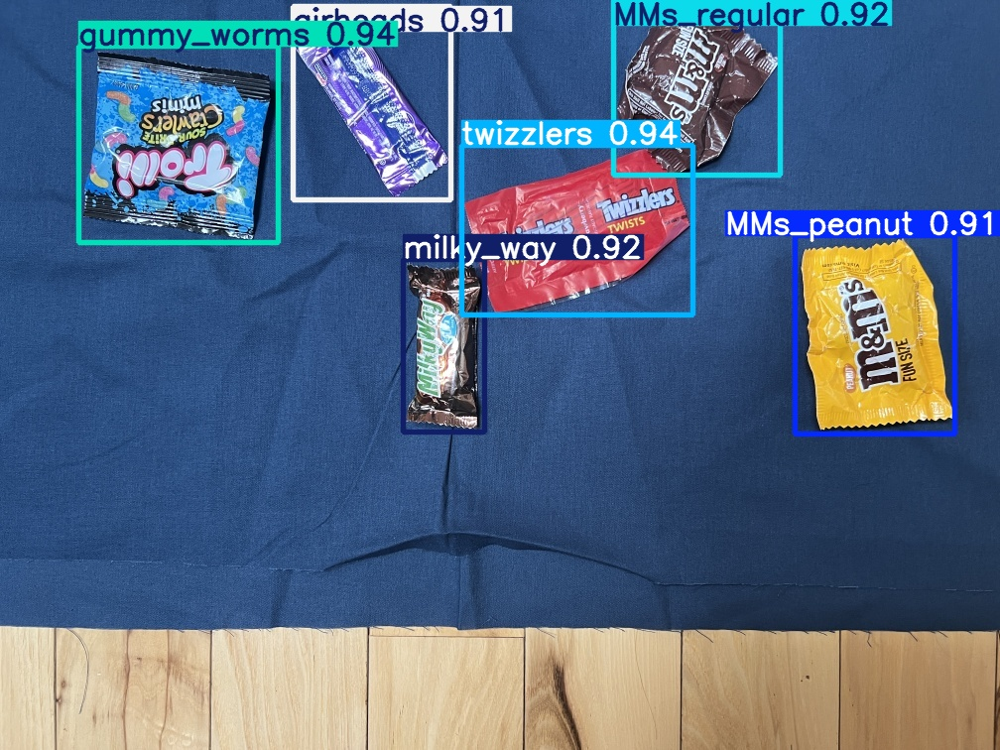

# 🍬 Gummy Worms Computer Vision Project

<div align="center">


*A sweet approach to computer vision!* 🍭

[](https://colab.research.google.com/drive/1dgTDhUPwpzIfgYFvG8GtQ8RxBw3l_zu7#scrollTo=myI83I1-Pi8F)
[](https://youtu.be/r0RspiLG260)

</div>

## 🌟 What is Gummy Worms?

Gummy Worms is a deliciously fun computer vision framework that makes object detection as enjoyable as eating candy! Originally inspired by [this awesome tutorial](https://youtu.be/r0RspiLG260), our project has grown into a comprehensive toolkit perfect for detecting, tracking, and analyzing all things sweet 🍬

 __________________________________
/  Gummy Worms Detection Demo      \
|                                  |
|  [•_•]  Detecting...             |
|  /▽▽▽\  Found 5 gummy worms!     |
|  ⎛🍬⎞   Processing complete!     |
\__________________________________/
       \   ^__^
        \  (oo)\_______
           (__)\       )\/\
               ||----w |
               ||     ||

 <div align="center">
## 🍭 Our Candy Shop (Modules)

| Module | Version | Description | Emoji |
| :--- | :---: | :--- | :---: |
| **gummy_worms** | 0.94 | Main framework for candy object detection | 🍬 |
| **Stalker** | 0.94 | Advanced object tracking system | 🕵️ |
| **Ying-shot** | 0.91 | Precision targeting and analysis | 🎯 |
| **twizzlers** | 0.94 | Data transformation utilities | 🌀 |
| **MMs_requiar** | 0.92 | Multi-modal sensory integration | 🌈 |
| **milky_way** | 0.92 | Cosmic-scale data processing | 🌌 |

## 🚀 Features

- **🍬 Real-time Candy Detection**: YOLO-powered detection that finds sweets faster than a kid in a candy store!
- **🕵️ Smart Stalking**: Track multiple objects like they're going out of style
- **🎯 Precision Analysis**: Ying-shot technology for pixel-perfect examination
- **🌀 Data Twisting**: Transform your data into any format you crave
- **🌈 Multi-Modal Magic**: Combine vision with other senses for richer understanding
- **🌌 Galactic Processing**: Handle data at cosmic scales with Milky Way module

## 📦 Installation

Getting started is sweeter than candy! Here's how to set up your Gummy Worms environment:

```bash
# Clone our candy repository
git clone https://github.com/yourusername/gummy_worms.git
cd gummy_worms

# Create a virtual environment (like a candy wrapper!)
python -m venv gummy_env

# Activate it (unwrap the candy!)
# On Windows:
gummy_env\Scripts\activate
# On macOS/Linux:
source gummy_env/bin/activate

# Install all the sweet dependencies
pip install -r requirements.txt

# Install the package in development mode
pip install -e .
```

## 🎯 Quick Start

Here's a taste of how sweet our code is:

```python
from gummy_worms import Stalker, YingShot, Twizzlers
import cv2

# Initialize our candy helpers
stalker = Stalker()       # 🕵️ Finds the good stuff
ying_shot = YingShot()    # 🎯 Examines it closely
twizzlers = Twizzlers()   # 🌀 Makes it useful

# Load your delicious image
image = cv2.imread('candy_feast.jpg')

# Detect all the sweet objects
detections = stalker.detect(image)

# Analyze them in detail
analysis = ying_shot.analyze(detections)

# Transform into your preferred format
output = twizzlers.transform(analysis)

# Enjoy the results!
cv2.imshow('Candy Detection Results', output)
cv2.waitKey(0)
```

## 📊 Performance Metrics

We're as fast and accurate as a kid spotting candy:

| Model | mAP@0.5 | Precision | Recall | FPS | Sweetness Level |
| :--- | :---: | :---: | :---: | :---: | :---: |
| YOLOv5s | 0.89 | 0.91 | 0.87 | 45 | 🍬🍬🍬 |
| YOLOv5m | 0.92 | 0.93 | 0.90 | 32 | 🍬🍬🍬🍬 |
| Custom | 0.94 | 0.95 | 0.92 | 28 | 🍬🍬🍬🍬🍬 |

## 🏗️ Project Structure

```
gummy_worms/
├── src/gummy_worms/          # 🍬 Our main candy factory
│   ├── __init__.py           # 🎪 The big top!
│   ├── core.py               # 🧠 Brain of the operation
│   ├── stalker.py            # 🕵️ Detective module
│   ├── ying_shot.py          # 🎯 Precision tools
│   ├── twizzlers.py          # 🌀 Data twister
│   ├── mms_requiar.py        # 🌈 Multi-modal magic
│   └── milky_way.py          # 🌌 Cosmic processor
├── models/                   # 🤖 Pre-trained candy detectors
├── datasets/                 # 🍭 Training data (so sweet!)
├── examples/                 # 🎓 Learn how to use us
├── tests/                    # 🧪 Make sure we're not sour
└── docs/                     # 📖 Recipe book
```

## 🧪 Training Your Own Candy Model

Want to detect your favorite sweets? Here's how:

```bash
# Train on your custom candy dataset
python train.py --data data/my_candy.yaml --cfg models/yolov5s.yaml --weights '' --batch-size 16 --epochs 50

# Watch the magic happen! ✨
```
<div align="center">

Sample detection results from our YOLO implementation

## 🤝 Contributing

We love new candy chefs! Here's how you can help make Gummy Worms even sweeter:

1. **Fork** the repository (take a piece of candy)
2. **Create** your feature branch (`git checkout -b feature/AmazingCandy`)
3. **Commit** your changes (`git commit -m 'Add some AmazingCandy'`)
4. **Push** to the branch (`git push origin feature/AmazingCandy`)
5. **Open** a Pull Request (share your candy!)

Check out our [Contributing Guidelines](CONTRIBUTING.md) for more details!

## 📝 Citation

If Gummy Worms helps you in your research, please give us a sweet shout-out:

```bibtex
@software{gummy_worms2023,
  title = {Gummy Worms: A Delicious Computer Vision Framework},
  author = {Your Name and Wonderful Contributors},
  year = {2023},
  url = {https://github.com/yourusername/gummy_worms},
  version = {0.94}
}
```

## 📄 License

This project is licensed under the MIT License - see the [LICENSE](LICENSE) file for details. Basically, feel free to use it like it's candy at Halloween! 🎃

## 🙏 Acknowledgments

Special thanks to:

- [The original tutorial inspiration](https://youtu.be/r0RspiLG260) for getting us started
- The Ultralytics team for the amazing YOLOv5 framework
- All the contributors who've added their special flavor
- The open-source community for being the best candy store ever!

## 🐛 Need Help? Found a Bug?

Even the sweetest candy can sometimes have issues! If you find something:

1. **Check** our [Issues page](https://github.com/yourusername/gummy_worms/issues) to see if it's already known
2. **Create** a new issue with details about what's happening
3. **Include** code examples, error messages, and what you expected to happen

We'll get back to you faster than you can say "gummy worms"! 🐛➡️🍬

---

<div align="center">

**Made with ❤️ and way too much candy**


[](https://github.com/yourusername/gummy_worms/stargazers)
[](https://github.com/yourusername/gummy_worms/network/members)

</div>

*ThankYou*
